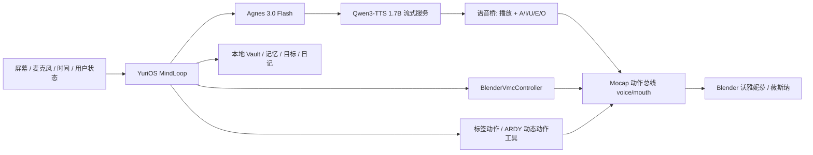

# 自主 AI 虚拟角色：GitHub 选型与改造方案

调研日期：2026-09-25

## 结论

主框架建议采用 **[YuriOS](https://github.com/yuri-os/YuriOS)**，但只把它当作“灵魂、记忆、自治和工具运行时”。角色身体继续使用已经验证的 Blender + VMC 动作总线，不迁移到网页 VRM。

辅助参考：

- **[Open-LLM-VTuber](https://github.com/Open-LLM-VTuber/Open-LLM-VTuber)**：借语音输入、VAD、打断、句子切分和 TTS 并发设计。
- **[Text-To-VRMA](https://github.com/Kirakun0328/text-to-vrma)** 与 **[Rexclaw](https://github.com/Codemarchant/rexclaw)**：借 ARDY 动作规划、动态手势工具与动作审核流程。
- **[Project AIRI](https://github.com/moeru-ai/airi)**：借桌面体验、插件/桥接协议和多端控制平面；不作为当前心智核心。

这不是把四个项目拼在一起运行。实现方式是 fork YuriOS，再写三个本机适配器；其他项目只借设计和少量 MIT 代码。

## 为什么选择 YuriOS

YuriOS 的定位与目标几乎一致：角色在无人注视时仍持续运行，有自己的目标、记忆、日记、承诺和受约束的主动行为。

源码中已经存在：

- `yurios/mind/loop.py`：`SENSE → APPRAISE → DECIDE → ACT → REFLECT → REGULATE` 常驻循环。
- `yurios/mind/goals.py`、`goalwork.py`：目标、承诺、到期与重新评估。
- `yurios/mind/dream.py`、`dreamjobs/`：离线记忆整理与夜间任务。
- `yurios/mind/policy.py`：ENGAGED / IDLE / DORMANT / DREAM 状态及主动打扰门控。
- `yurios/mind/budget.py`：模型调用预算；APPRAISE 本身不调用模型。
- `yurios/app/memory/`：文件/Git 为权威源、向量索引只是可重建缓存。
- `yurios/kernel/hub.py`：统一事件总线。
- `yurios/world/avatar/controller.py`：身体控制薄层，适合替换。
- `yurios/app/providers/base.py`：只有 `ChatModel / UtilityModel / Embedder` 三个协议，厂商依赖隔离良好。
- `tests/`：项目说明记录 1668 项测试，包括多日自治场景、承诺、静默约束、预算、重启恢复和事件总线。

项目为 Apache-2.0，版本 0.2.0，GitHub 显示约 304 次提交。它仍是年轻项目，因此需要固定上游 commit、保留我们的适配层，并先跑离线测试再启用自主工具。

## 候选比较

| 项目 | 适合直接借什么 | 与当前系统的冲突 | 结论 |
|---|---|---|---|
| YuriOS | 自治循环、记忆、目标、日记、主动行为门控、事件总线 | 默认身体是网页 VRM；provider 列表需加 Agnes；TTS 需改 HTTP | **主框架** |
| AIRI | 成熟桌面端、VRM/Live2D、多设备插件协议、游戏桥 | 截至当前，完整长期记忆与 heartbeat 自治仍是讨论/开发项；TS/Rust 大型单仓 | 借 UI/插件设计 |
| Open-LLM-VTuber | OpenAI 兼容 LLM、ASR/VAD、语音打断、TTS 并发、主动说话入口 | Live2D 为主；记忆主要是短期和聊天记录；自治较浅 | 借语音管线 |
| Rexclaw | 3D VRM、实时口型、长期记忆、动作工具、直接调用 Text-To-VRMA/ARDY | 核心语音和工具强绑定 xAI/Grok；换 Agnes + 本地 TTS 工作量较大 | 借动作工具协议 |
| Text-To-VRMA | ARDY 本地 HTTP API、动作规划/审核、情绪动作、候选比较 | 输出 VRMA，需要转入现有 VMC/动作总线；它不是心智系统 | 借动态动作生成 |
| LiveTalking | 音频到口型、打断、WebRTC/虚拟摄像头 | 以 2D 视频换脸/说话头为核心，额外占 GPU，绕开 Blender 身体 | 不采用 |
| AILIS | 宣称具备桌面角色、记忆和 Agent Harness | 项目样本和社区规模很小，证据不足 | 暂不作为底座 |

## 我们的目标架构

YuriOS 的网页 VRM Viewer 不作为权威身体。浏览器只保留“心智调试、记忆、日记、权限和状态”页面；Blender 才是角色本体。

## 三个核心适配器

### 1. AgnesProvider

新增 `yurios/app/providers/agnes.py`：

- 实现 `ChatModel.stream` 和 `UtilityModel.complete`。
- Base URL：`https://apihub.agnes-ai.com/v1`。
- Model：`agnes-3.0-flash`。
- 密钥从现有 `~/.config/virtual-idol/agnes.env` 读取，不写入仓库或角色 Vault。
- 对 429/5xx 使用有界退避；不让自动 tick 无限重试。
- 对免费 20 RPM 设置独立聊天/自治速率桶。APPRAISE 不调用模型，绝大多数 tick 保持 REST。

### 2. QwenVoiceOutput

新增 HTTP TTS 后端，不使用 YuriOS 自带的进程内 Qwen 权重：

- 调用 `127.0.0.1:8091/v1/audio/speech`。
- 使用已经验证的 `akari2` x-vector 克隆。
- 将 PCM 交给 `outputs/虚拟偶像语音桥/voice_avatar_bridge.py`。
- 播放与 A/I/U/E/O 口型使用同一 DAC 时钟。
- 实现取消令牌：用户插话时停止音频并立即向 UDP 39543 发送闭嘴帧。

### 3. BlenderVmcController

替换 YuriOS 的 `VrmController`，方法映射：

| YuriOS 控制 | 本机实现 |
|---|---|
| `set_expression` | 动作总线新增 `emotion` 表情源或 VMC 表情事件 |
| `set_mouth` | 保留给语音桥，普通心智事件不直接抢嘴型 |
| `look_at*` | 头/眼独立 gaze 来源 |
| `play_animation` | `/api/action` 标签动作；动态动作走 ARDY 工具 |
| `set_bone/reset_bone` | 临时高优先级身体部位路由 |
| `scene_state` | 读取动作总线、Blender、TTS 和用户在场状态 |

适配器只发布事件，不导入 `bpy`，因此心智崩溃不会拖死 Blender，Blender 重启也不会清空记忆。

## 动作设计

动作分为三层：

1. **反射层（无需 LLM）**：眨眼、呼吸、听人说话时点头、说话时小幅手势。
2. **标签动作层（立即调用）**：现有日常/舞蹈/手势库；心智输出结构化标签。
3. **生成层（慢速）**：没有合适标签时调用 ARDY。参考 Text-To-VRMA 的本地 `POST /v1/motions`、planner、候选比较和审核，但输出转换为当前动作总线 clip/VMC，不改变 Blender 本体。

模型每次回复不应自由生成每帧骨骼。它只决定意图、情绪、动作标签与强度；确定性控制器负责具体执行和冲突仲裁。

## 实施顺序

### 阶段 0：冻结基线（1 天）

- Fork YuriOS，固定 commit。
- 运行其离线测试；记录 Windows/WSL 基线。
- 禁用 mind hands、Telegram、图像生成和网页 VRM 身体。

### 阶段 1：一轮完整对话（2–4 天）

- AgnesProvider。
- QwenVoiceOutput。
- BlenderVmcController 最小版。
- 完成“用户文字 → Agnes → 语音 → 口型 → Blender”。

### 阶段 2：身份与长期记忆（2–4 天）

- 建立角色 Vault、PERSONA、USER、episodic/semantic memory。
- 迁移当前角色名、偏好、动作库和模型信息。
- 验证重启后记忆与语音/身体解耦。

### 阶段 3：安全的自主生活（3–7 天）

- 开启 MindLoop，但 `MIND_TOOLS_ENABLED=false`。
- 先允许日记、目标、记忆整理和极低频主动开口。
- 设置安静时段、每日主动次数、Agnes RPM/Token 预算。

### 阶段 4：情绪与动作（5–10 天）

- 情绪、目光、姿势、标签动作工具。
- ARDY 动态动作作为低频 fallback。
- 动作冲突、说话中断和物理稳定回归。

### 阶段 5：听觉、视觉和工具（1–2 周）

- 参考 Open-LLM-VTuber 的 VAD、回声抑制、barge-in。
- 接屏幕上下文、文件和受控 MCP 工具。
- 自主工具始终经过 allowlist、额度和日志审计。

可用 MVP 约 2–4 周；长期稳定、观感自然、可连续运行的版本约 1–2 个月。主要难点是动作/情绪仲裁、打断、长时间稳定与“什么时候不说话”，不是调用 LLM。

## 不直接整套照搬的原因

- 现有 Blender 物理和 PMX 表现已经经过用户验收，迁移 VRM 会丢失这些成果。
- AIRI/Rexclaw 的网页身体与我们的本体重复。
- LiveTalking 的神经口型是为视频脸设计，会额外占用显存。
- Agnes 免费 API 需要节流；不能让自治 loop 每个 tick 都调用模型。
- “像真人”主要来自持续状态、克制、记忆一致性和动作时机，而不是让模型自由输出更多文字。

## 2026-09-25 本机烟测结果

- 已从官方主分支归档固定源码 commit `d074a0b3ed14269c748757074734a7bba2122d28`，位置为 WSL `/home/mozi/yurios-eval/src`。
- 源码包含 214 个 Python 文件和 120 个测试文件。补齐前端目录与测试 Git 身份后，完整套件结果为 **2070 passed、16 skipped、0 failed**，耗时 25.69 秒。
- Agnes 3.0 Flash 已通过 YuriOS 自带的 LiteLLM provider 流式调用成功，不需要立即新增 provider 文件。角色宿主需要一个命名连接配置，把自定义端点和 `YURIOS_MODEL_API_KEY_*` 密钥变量绑定；只在 `.env` 写 `CONNECTION_API_KEY` 会被角色级连接配置清空。
- YuriOS `doctor` 会把自定义 `lm_studio/` 端点报告成“本机模型”，即使端点实际是远端 Agnes。这条隐私报告不可靠，正式 fork 需要修复。
- 默认英文 `BAAI/bge-small-en-v1.5` 能写入中文日记，但中文召回失败。替换为本地 `bge-small-zh-v1.5`（512 维）并自动重建索引后，重启、全新会话可以正确召回“今天只做安全烟测，不调用任何工具”。
- 首次加载中文向量模型的完整回合约 22.5 秒；常驻后的完整回合约 6.26 秒；进程重启并重新加载模型后的首轮约 9.12 秒。Agnes 本身首字约 5 秒，是当前主要对话等待。
- 世界/角色对话路径会等待 `brain.persist()` 完成后再提交最终消息；向量模型缺失时会让回合长时间挂起。正式适配应把记忆写入改成有界、异步的后台任务，并让失败不影响用户看到回复。
- 当前试验服务运行于 `http://127.0.0.1:8768/`；工具、搜索、语音输入输出和主动打扰均关闭。网页前端已在 Windows Node 24 下构建并部署。

因此，YuriOS 通过了“代码不是概念 Demo、心智状态机可运行、持久中文记忆可恢复”的最低门槛，但没有通过“默认配置即可用于中文实时虚拟人”的门槛。下一阶段应继续把它当作可拆取的心智层，不让它接管现有 Agent、语音或 Blender 运行时。

### 混合架构第一步已落地

`outputs/虚拟偶像心智桥/mind_action_bridge.py` 已将 YuriOS 的角色事件流接到现有动作总线标签接口。当前只根据用户原话中的显式动作词生成 allowlist 意图，角色回复不能自触发；调用前核对实时动作目录与目标角色订阅状态，带事件去重和动作冷却。

真实 YuriOS 对话“请跳一小段舞”已解析为 `dance-steps-a / full / loop=false`；沃雅妮莎离线时正确记录为 deferred。真实动作总线也已完成一次 `daily-walk-wave-ardy / arms` 契约调用并立即停止。8 项本地测试通过，详细证据见 `outputs/虚拟偶像心智桥/验证报告.json`。

随后完整接通了声音和角色本体：YuriOS 已提交回复会同时调用标签动作与 `voice_avatar_bridge.py`，后者调用本机 Qwen3-TTS 1.7B、实际播放 PCM，并按同一 DAC 时钟向 UDP 39543 发布 A/I/U/E/O。真实“挥手并介绍自己”回合观察到 ARDY 双臂挥手、32 个语音口型包、5 个元音通道、256 个发往沃雅妮莎的总线包；语音结束后动作和嘴型均复位。Blender 物理仍为约 30 FPS。

用户新一轮输入会终止旧 TTS、发送闭嘴帧并停止旧动作。长语音中发送“停一下，只回答好”已验证旧语音/动作中断，随后只播放新回复“好。”。桥现有 10 项测试通过，所有连接、动作、语音、打断与错误追加到 `outputs/虚拟偶像心智桥/审计记录.jsonl`。

### ARDY 动作记忆与 System 1 反射层

用户随后明确要求清除旧动作库，并保证未来活动动作直接或间接来自 ARDY。原 16 条目录动作以及 CMU、Kimodo、旧 ARDY 示例共 25 个 clip 已移至 `outputs/Mocap动作总线/archived-legacy-actions-20260925-1716`；活动 `action_catalog.json` 为 `[]`。新版总线提供受目录限制的 `POST /api/generated-action`，只读取 `clips/generated` 中通过原有骨骼/有限数验证的 clip。

Agnes 现输出 `none / catalog / generate` 三态语义动作决策。目录外“像企鹅一样走两步，再用左手挥手，最后站好”被改写为英文 ARDY 提示，常驻 MiniLM ARDY 约 17 秒生成 100 帧/20 FPS 动作并直接播放。动作以稳定 SHA-256 缓存键写入 `clips/generated/library.json`；另一种中文表达在约 4.35 秒的普通规划窗口内以 0.98 置信度命中同一动作，不再生成，并把调用次数更新为 2。

Laya System One 0.3.20 已实际接成 GPU 条件反射层，使用独立 CUDA 环境和 322M 多语言 checkpoint；本地中文 BGE 先检索保存动作，Laya 再做 `choice/noul` 门控。零样本 Laya 单独选择会过度复用唯一动作，因此不能裸用。组合阈值在 12 条中文校准集上把 4 条熟悉同义、3 条普通聊天、5 条不同新动作全部正确分流。

正式链路观测：熟悉企鹅动作约 207 ms 复用；天气聊天约 95 ms 判定无需动作；第二条“三圈 + 鞠躬”动作第一次由 Agnes + ARDY 生成并保存，另一种表述随后约 94 ms 由 Laya 直接复用。Laya 不替代动作生成器或动作资产验证，低置信度仍交给 Agnes/YuriOS，缺失动作仍由 ARDY 生成并写回程序性记忆。

## 本地调研副本

- `work/github-candidates/Open-LLM-VTuber`：浅克隆 commit `992309c0aa19845960228f880013d4685fde93b5`，MIT。
- `work/github-candidates/text-to-vrma`：浅克隆 commit `b8081875916c8621c7ec226b4adcb2c70e7b13b7`，MIT。
- YuriOS：官方主分支归档已完整解包到 WSL `/home/mozi/yurios-eval/src`，固定 commit `d074a0b3ed14269c748757074734a7bba2122d28`；隔离环境在 `/home/mozi/yurios-eval/.venv`，试验数据在 `/home/mozi/yurios-eval/runtime`。
